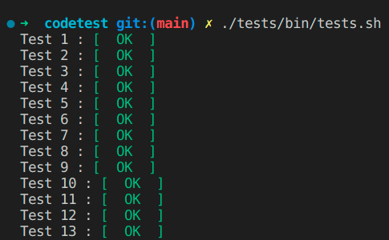

# Módulo de objetivos (droide YVH)

A continuación añado una breve documentación acerca de los aspectos más importantes de este módulo de objetivos diseñado para el droide de combate YVH.

## Puesta en marcha

### Requisitos

Será necesario disponer de la siguiente configuración en aquel equipo donde se ejecutará este módulo:

- node.js
- npm
- nvm

### Arrancando el sistema

Para que el módulo comience a escuchar peticiones HTTP será necesario ejecutar los siguientes comandos:

```
nvm use
npm i
npm run dev
```

Las peticiones serán atendidas por defecto en la siguiente url base, siendo el valor del puerto (8888 por defecto) fácilmente configurable desde el fichero `.env`:

```
http://localhost:8888
```

Los tests proporcionados por la Nueva República podrán ejecutarse una vez arrancado el sistema mediante el siguiente comando:

```
./tests/bin/tests.sh
```

### Comprobando los test de la Nueva República

Los test proporcionados por la Nueva República se han ubicado en la
carpeta `tests` del proyecto, y para su ejecución será necesario el
siguiente comando:

```
./tests/bin/tests.sh
```

El resultado debería ser algo similar a lo siguiente:



## Documentación

* [Modelo de datos](./doc/entities.md)
* [Inclusión de nuevos protocolos](./doc/new-protocols.md)
* [Complejidades](./doc/complexity.md)
* [Librerías utilizadas](./doc/libraries.md)
* [Requisitos originales](./doc/requirements.pdf)
