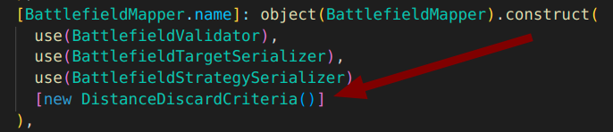

# Inclusión de nuevos criterios de descarte

Uno de los criterios de descarte requeridos en el enunciado es el de ignorar aquellos objetivos que se encuentran a más de 100 metros.

Dado que estos criterios son susceptibles de ser ampliados o modificados, la aplicación ofrece facilidades para ello.

Todo nuevo criterio de descarte debe implementar la interfaz `BattlefieldDiscardCriteria` e implementar la lógica de descarte dentro del método **isDiscarded(BattlefieldTarget): boolean**.

Una vez añadido, simplemente bastará con inyectar el nuevo criterio en la colección de criterios de descarte que recibe la clase `BattlefieldMapper`, el cual será tenido en cuenta automáticamente en el mapeado inicial del campo de batalla.

Esta colección se encuentra en el fichero `src/config/deps.ts`.

