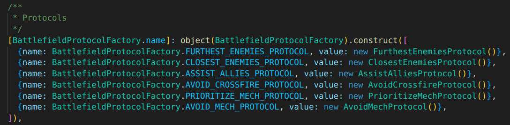

# Inclusión de nuevos protocolos

## Requisitos

Para la aplicación de protocolos se ha utilizado el patrón `StrategyPattern`,
por lo que simplemente será necesario que el protocolo implemente la interfaz
`BattlefieldProtocol`.

Esta interfaz cuenta con los siguientes métodos:

* **prioritizeTargets(Targets[]): Targets[]** - Recibe una lista de objetivos y devuelve
aquellos que cumplen con los criterios del protocolo.

* **getIncompatibleProtocols(): string[]** - Devuelve una colección con los nombres
de clase de los protocolos incompatibles con el actual, como podrían ser `closest-enemies`
y `furthest-enemies`, de manera que se pueda alertar al cliente en caso de intentar aplicar
protocolos incompatibles.

* **isDependent(Protocol): bool** - Recibe un protocolo e informa si el protocolo actual es
dependiente de él o no. Se utiliza para aplicar los protocolos por un orden de prioridades,
como se explica en el [modelo de clases](./entities.md).

## Facilidades

Una estrategia que puede resultar útil en el momento de añadir un nuevo protocolo es heredar
de la clase `BattlefieldAbstractProtocol`.

Esta clase cumple con la interfaz `BattlefieldProtocol`, y proporciona una implementación común
a todos los protocolos existentes, de forma que en cada protocolo únicamente se necesitará añadir
aquel código que difiera de los demás.

Así, los métodos de los nuevos protocolos que hereden de esta clase deberían implementar son los
siguientes:

* **initialize(Targets[]): void** - Permite inicializar los atributos de clase particulares de
cada protocolo haciendo uso de la colección de objetivos. Un ejemplo de su uso son los protocolos
`closest-enemy` y `furthest-enemy`, los cuales almacenan en un atributo de clase la distancia
menor y mayor respectivamente, para luego hacer uso de ella.

* **meetRequirements(Target): bool** - Devuelve un booleano indicando si el objetivo cumple
con los requisitos del protocolo.

* **getDependencies(): string[]** - Devuelve una colección con el nombre de clase de aquellos
protocolos de los que depende.

## Uso

Una vez implementados correctamente los métodos de la interfaz, sólo hará falta
añadirlo a la colección de servicios que recibe la clase `BattlefieldProtocolFactory`,
encargada de devolver la instancia del servicio correspondiente en función del nombre con
el que se ha mapeado.

Esta colección se encuentra en el fichero `src/config/deps.ts`.

